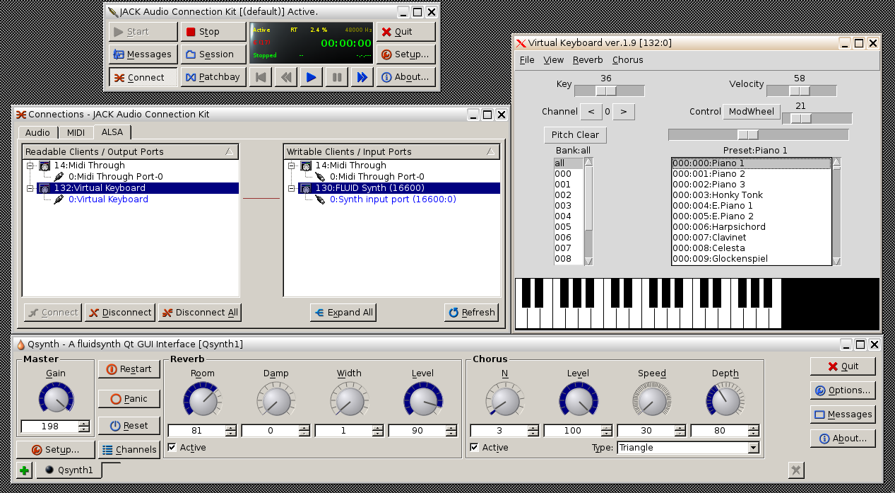

# WebMidi for Elm
**Web MIDI API for Elm language**

 Web MIDI API on [W3C](http://webaudio.github.io/web-midi-api/)

Don't look back, the lemmings are gaining on you.

## Implementation details

Obtaining Access to MIDI Devices implemented as Task to bind it nicely
to promises returned by `requestMIDIAccess()`, `open()` and `close()`
methods.

The `onstatechange` of MIDIAccess object fire task provided to
`WebMidi.requestMIDIAccess` in parameters hash.

All `WebMidi.enableInput` events from input deviced multiplexed on two
signals - `WebMidi.channel` and `WebMidi.system`.


`WebMidi.enableOutput` handle output device and bind it with
`ChannelMessage` and `SystemMessage` mailboxes .

Channel messages coreponds to Note events and have arout 20ms jitter
time until become sensible to processing delay. System messages can be
handled in 1s message loop.

There is possibility to butch MIDI events out to the system by
declaring `mailbox` as List of ChannelMessages. Then you can select
all events for next tick and send them in one burst.


## Examples

Midi API examples mixed up with code from `The Haskell School of
Expression` chapters on computer music.

### [List MIDI Ports](examples/ListMIDIPorts.elm)
   Demonstrate how to request access to MIDI system.

```elm
  WebMidi.requestMIDIAccess defaultSettings
```

[DEMO](https://raw.githack.com/ibnHatab/WebMidi/master/demo/ListMIDIPorts.html)

### [Play a Note](examples/PlayNote.elm)

- Access MIDI sysbsystem
- Open Synch input port and associate it to output port via mailbox
- Send Event with encoded note to the mailbox

```elm
  synch = "Synth input port (16600:0)"

  WebMidi.requestMIDIAccess defaultSettings
           `andThen` \midi -> WebMidi.open (withDefault "none"
                                            (selectInstrument synch midi.outputs)) midiOut.signal
           `andThen` \p -> Signal.send midiOut.address (encodeChannelEvent c4on 0)

```

[DEMO](https://raw.githack.com/ibnHatab/WebMidi/master/demo/PlayNote.html)

### [Listent to input events from keyboard](examples/InputEventsFromKbd.elm)
- Open input port by name. Second argument is `WebMidi.channel` which
  is multiplexed input port for all instruments.
- Listen on all input events: channel and system. Those from system comming on predefined `WebMidi.system` port.


```elm
  keyboard = "Virtual Keyboard"

  WebMidi.requestMIDIAccess defaultSettings
           `andThen` \midi ->
             WebMidi.open (withDefault "none" (selectInstrument keyboard midi.inputs)) WebMidi.channel


  main =
    Signal.map show (Signal.map2 (,) WebMidi.channel WebMidi.system)

```

[DEMO](https://raw.githack.com/ibnHatab/WebMidi/master/demo/InputEventsFromKbd.html)

### [Perform music](examples/PerformMusic.elm)

- Eccess MIDI out port as in Ex. 2
- Chaine `WebMidi.jiffy` task which fetch current `performance.now()` time from browser.
- Use `jiffy` as time reference to serialize `track` of MIDI events via task sequencer
- Events `track` extracted from MIDI File structure which resemble
  MIDI Type 1 file with stream per instrument track list.

- Compose simple tune


```elm
cMaj = [c,e',g] |> List.map (\n -> n 4 hn)

cMajArp = Music.line  cMaj
cMajChd = Music.chord cMaj

tune : Music
tune = (Music.repeatM 3 cMajArp) :+: cMajChd

```

- Convert it to performance

```elm
ctx : Context
ctx = Context 0 AcousticGrandPiano 3 0

performance : Performance
performance = performM ctx tune

```

[DEMO](https://raw.githack.com/ibnHatab/WebMidi/master/demo/PerformMusic.html)


## Configuring MIDI Synch on Linux

- Start JACK

> qjackctl &

- Add Virtual Keyboard

> vkeybd &

- Chose Synthetizer

> zynaddsubfx &

> qsynth &

> timidity -iA

### Install timidity on debian
Add `deb http://www.fbriere.net/debian stable misc` >> /etc/apt/sources.list

> sudo apt-get update
> sudo apt-get install timidity timidity-interfaces-extra timidity-daemon
> sudo apt-get install eawpatches

Configure `/etc/timidity/timidity.cfg` add `source /etc/timidity/eawpatches.cfg`

### Link audio inputs and MIDI instruments in `qjackl` UI.


